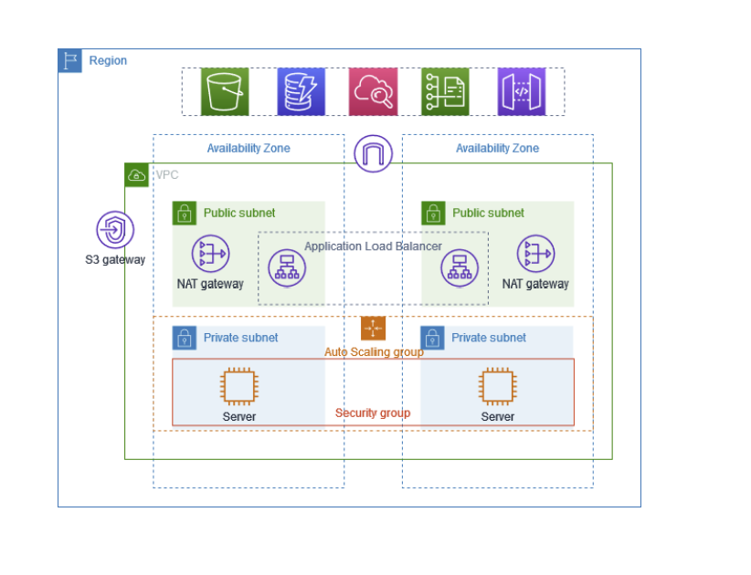

# 🚀 Welcome to our AWS Deployment with Terraform! 🌟

This Terraform script orchestrates the creation of a robust AWS infrastructure for our **Demo Application** following a two-tier architecture (Note: Please ignore S3 connection as we are going to use in our case).



## 🌐 Network Configuration

We're setting up the network foundation:

- **VPC (Virtual Private Cloud)**:
  - Creates a secure and isolated network environment with the CIDR block `10.0.0.0/16`.
  - Named `main`, it serves as the backbone of our infrastructure.
  
- **Internet Gateway**:
  - Establishes connectivity between our VPC and the internet, enabling outbound access and allowing public resources to be accessible from the internet.
  
- **Public and Private Subnets**:
  - Divides our network into distinct segments:
    - **Public Subnets** (`10.0.<az>.0/24`):
      - Placed in different availability zones (`<az>`) to ensure high availability.
      - Public-facing resources like load balancers reside here.
    - **Private Subnets** (`10.0.<az+2>.0/24`):
      - Houses backend services and database instances.
      - Isolated from direct internet access for enhanced security.

- **NAT Gateway**:
  - Provides outbound internet access for instances in private subnets.
  - Allows private instances to initiate outbound connections while preventing inbound traffic from reaching them directly.

- **Route Tables**:
  - Manages the routing of traffic within the VPC and to external networks:
    - **Public Route Table**:
      - Routes internet-bound traffic to the internet gateway.
      - Routes internal traffic within the VPC.
    - **Private Route Table**:
      - Routes outbound traffic to the NAT gateway for internet access.
      - Routes internal traffic within the VPC.

## 🌟 Load Balancing

Ensuring efficient traffic distribution:

- **Application Load Balancer (ALB)**:
  - Balances incoming HTTP traffic across instances for high availability and fault tolerance.
  - Named `public-lb`, it distributes traffic to backend instances.

- **Target Groups**:
  - Defines the targets for the ALB to distribute traffic.
  - Named `public-lb-target-group`, it specifies the instances behind the ALB.

- **ALB Listener**:
  - Listens to incoming traffic on port 80 and forwards it to the target group for processing.

## 🛡️ Security Configuration

Keeping our infrastructure secure:

- **Security Groups**:
  - Controls inbound and outbound traffic to and from instances:
    - `allow-http-lb`:
      - Allows HTTP traffic for the ALB.
    - `allow-http-ec2`:
      - Allows HTTP and SSH traffic for EC2 instances.
    - `jump-ec2`:
      - Allows SSH traffic for the jump host.

- **Key Pair**:
  - Creates an SSH key pair named `AWSKey` for accessing EC2 instances securely.

## 🚀 Compute Resources

Scaling our application:

- **Launch Template**:
  - Configures the specifications for EC2 instances, including the instance type and security group.
  - Named `ec2-template`, it defines the template for launching EC2 instances.

- **Autoscaling Group**:
  - Automatically adjusts the number of instances based on demand to maintain performance and availability.
  - Named `ec2-autoscaling`, it ensures the desired capacity is met and scales up or down as needed.

## 🌟 Additional Components

Enhancing functionality:

- **Elastic IP (EIP)**:
  - Provides a static IP address for EC2 instances, enabling them to retain the same public IP even after restarts.

- **Jump EC2 Instance**:
  - Acts as a gateway for SSH access to private instances, facilitating secure communication within the network.

---

With this comprehensive setup, our Demo Application is poised for success in the AWS cloud as a two-tier architecture! ✨🌟💫

## Usage

To deploy this infrastructure:

Clone this repository:
```bash
git clone https://github.com/erom-teknas/two-tier-aws-terraform.git
```

Navigate to the cloned directory:
```sh
cd two-tier-aws-terraform/terraform
```

Initialize Terraform:
```sh
terraform init
```

Review the plan:
```sh
terraform plan
```

Apply the Terraform configuration:
```sh
terraform apply
```
Disclaimer: Running this Terraform script may incur charges on your AWS account. Ensure that you understand the costs associated with the resources being provisioned and terminate them when no longer needed to avoid unexpected charges.


